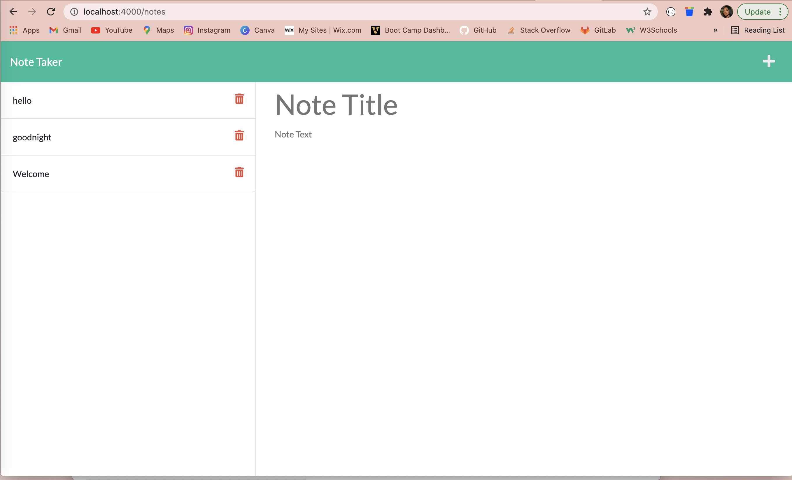

# Note-Taker-Application

## Table of Contents
### Description
### Images
### Deployed Application

## Description
This project focuses on creating an application that can be used to write and save notes, specifically using Express.js to save and retrieve note data from JSON file. The note-taking application will present a landing page with a link to the notes page, and then clicking the link will take you to a page with existing notes statically structured. The application when saved will appear an existing note in the list and will give you the ability to delete the note if need be. 

## Images
Below are the images of the Note Taker application:

## Deployed Application
To test this application for yourself, follow the link below:
<a href="https://https://notetakerapp-01.herokuapp.com/">Create Your Note!</a> 