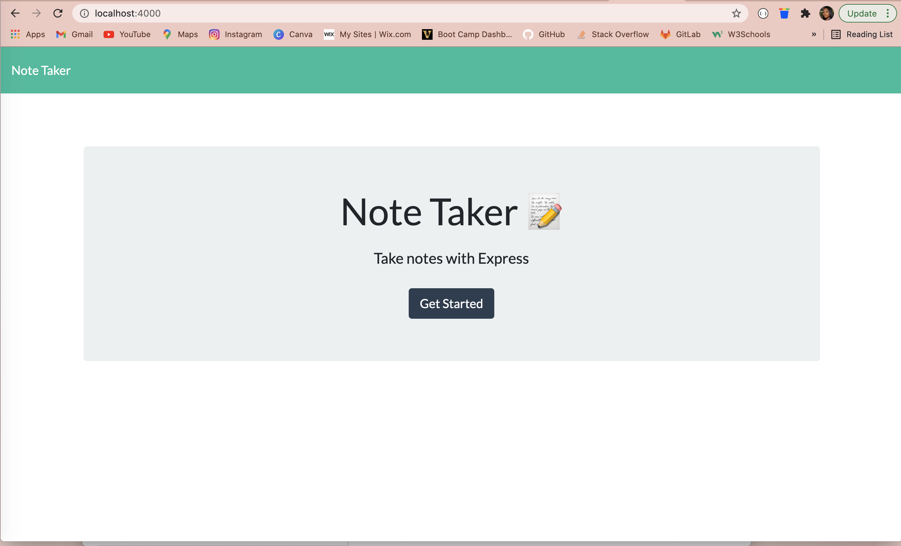
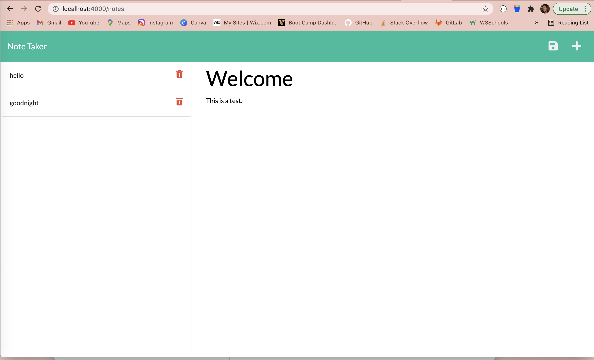

# Note-Taker-Application

## Table of Contents
### Description
### Images
### Usage Instructions

## Description
This project focuses on creating a high-quality README for an application. The README Generator will include information including what the application is for, how to use the application, how to install it, how to report issues or questions, how to make contributions, and how to choose a specific license for your application. The project is easily done in the command-line application to generate a README through index.js (specifically used in this project). Through this dynamically generated README file, I used the Inquirer package to help you create the best possible Professional README for your application and for anyone to understand how to walk-through your project effectively.

## Images
Below are the images of the Note Taker application:

To test this application for yourself, follow the link below:
<a href="https://gracetalks.github.io/Cynthia-Career-Portfolio/">Create Your Note!</a> 